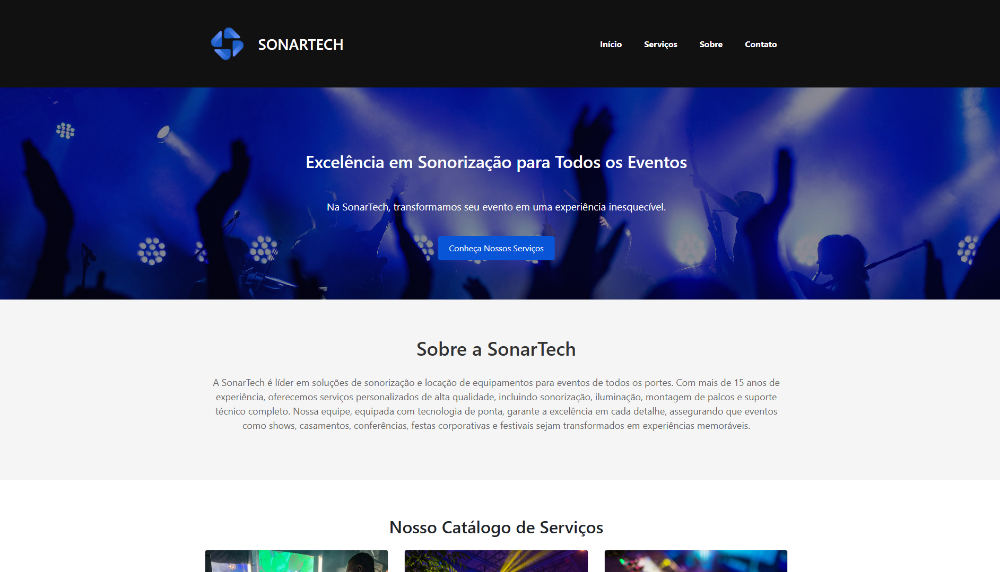

# 🎧 SonarTech – Soluções em Sonorização e Eventos

Este projeto é o meu primeiro website, desenvolvido como parte do trabalho da disciplina **Fundamentos ao Desenvolvimento Web** na **Universidade do Oeste de Santa Catarina (UNOESC)**, durante o ano de 2024.

## 🏗️ Sobre o Projeto

O objetivo era criar um site institucional para uma empresa fictícia, aplicando os conhecimentos adquiridos ao longo da disciplina. A empresa escolhida foi a **SonarTech**, especializada em soluções de sonorização e locação de equipamentos para eventos de todos os portes.

## 🌐 Acesse o Site

Você pode visualizar o projeto publicado no GitHub Pages:

🔗 [zuffoo.github.io/SonarTech](https://zuffoo.github.io/SonarTech/)

## 🛠️ Tecnologias Utilizadas

- HTML5
- CSS3
- Bootstrap 5
- JavaScript

## 📄 Estrutura do Projeto

📁 SonarTech/
├── index.html
├── style.css
└── images/
    ├── bg/
    ├── clientes/
    ├── logos/
    └── servicos/
└── README.md

## 🎯 Objetivos de Aprendizado

- Compreender a estrutura básica de um site.
- Utilizar HTML para organizar o conteúdo.
- Aplicar estilos com CSS externo.
- Implementar componentes com Bootstrap.
- Adicionar interações simples com JavaScript.
- Publicar o site utilizando o GitHub Pages.

## 🧑‍🎓 Contexto Acadêmico

Este site foi desenvolvido como parte da avaliação prática da matéria **Fundamentos ao Desenvolvimento Web** da **Universidade do Oeste de Santa Catarina (UNOESC)**, no ano de **2024**.

## 📝 Observações

- Projeto desenvolvido com fins educacionais.
- O foco principal foi o aprendizado inicial, portanto, algumas funcionalidades podem ser limitadas.

## 📸 Capturas de Tela

Aqui está uma captura de tela do site:

---

Desenvolvido por [Ricardo Zuffo]
